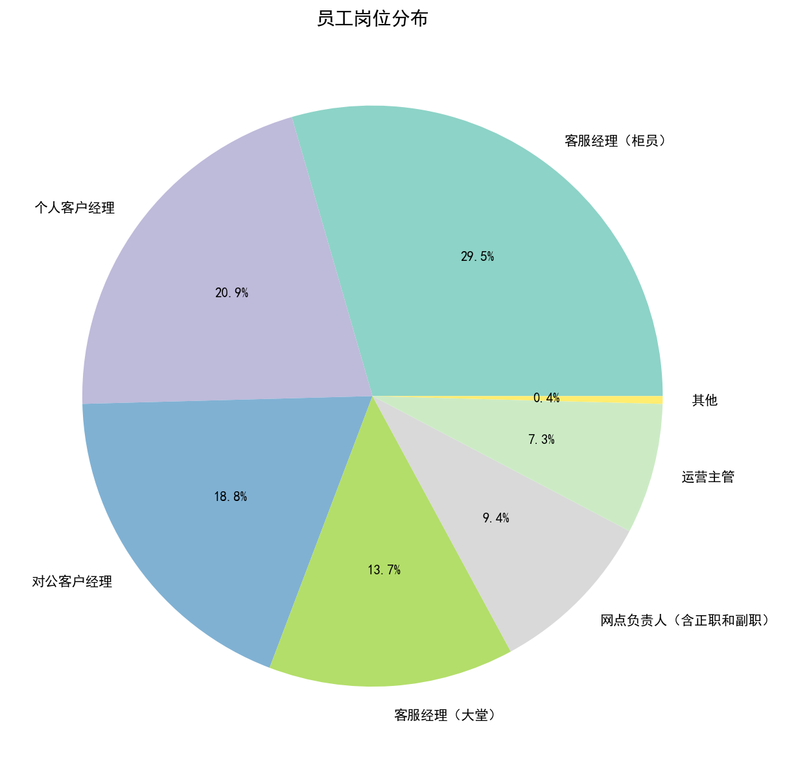
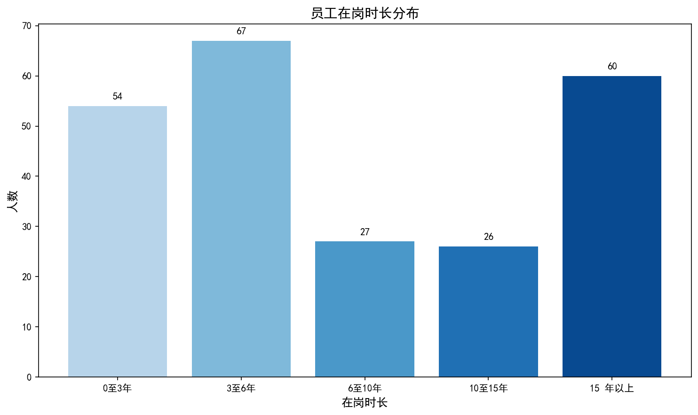
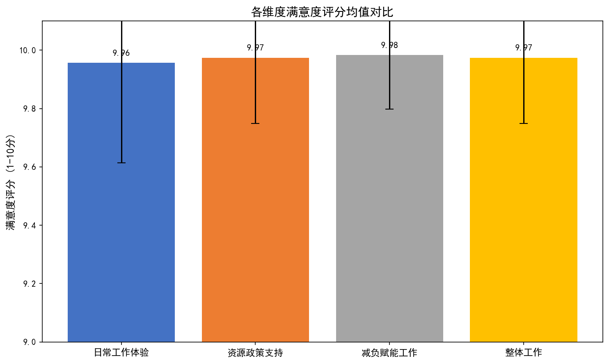
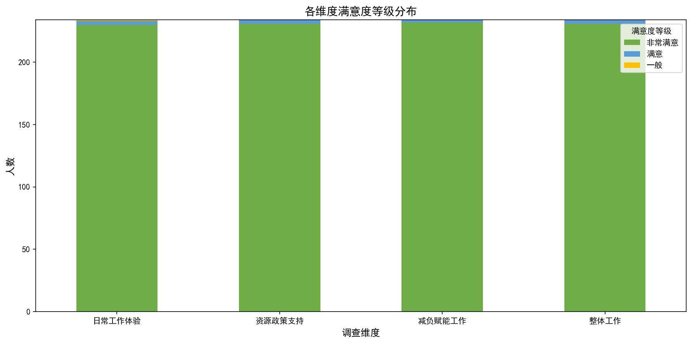
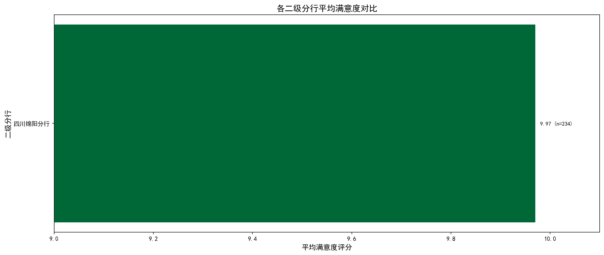
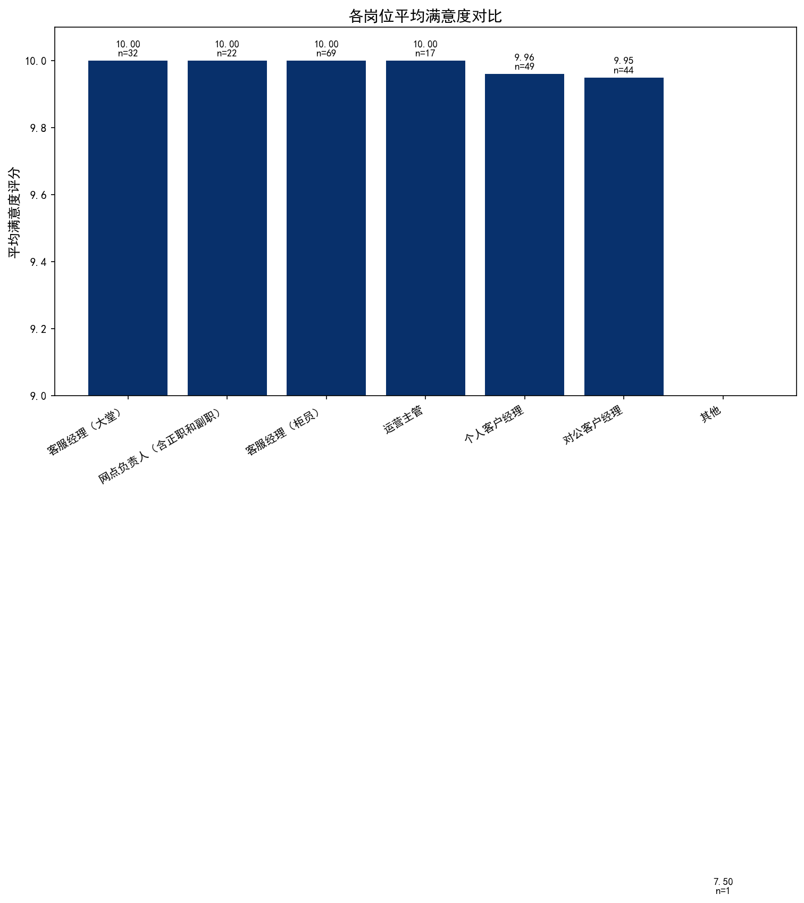
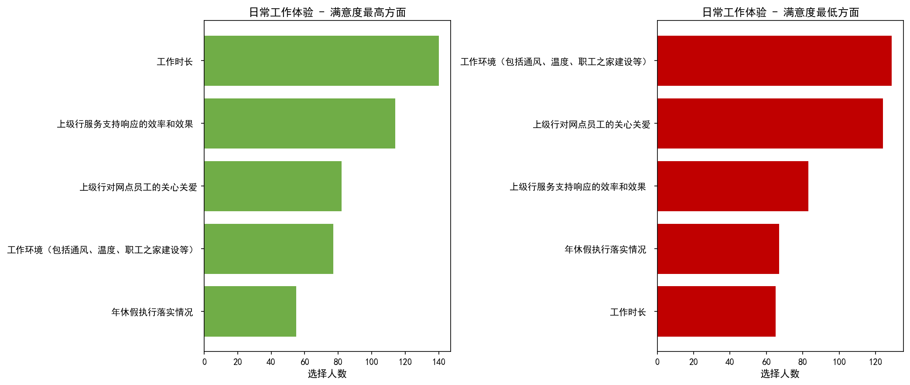
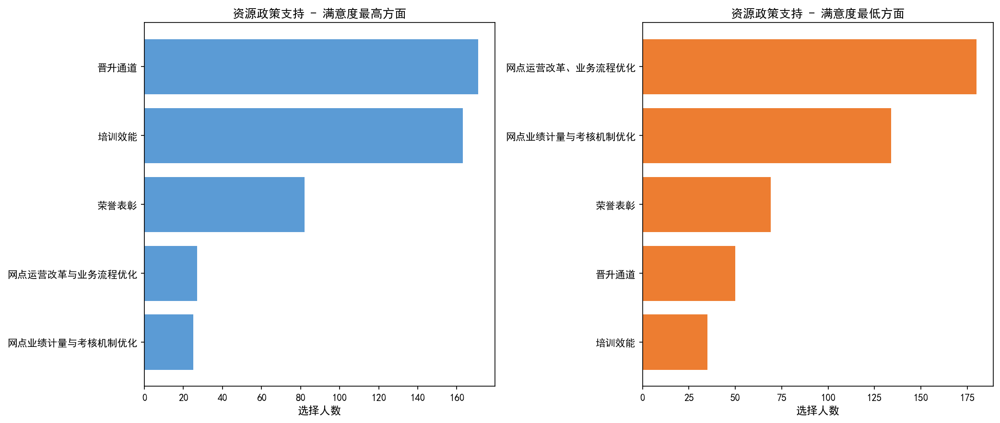
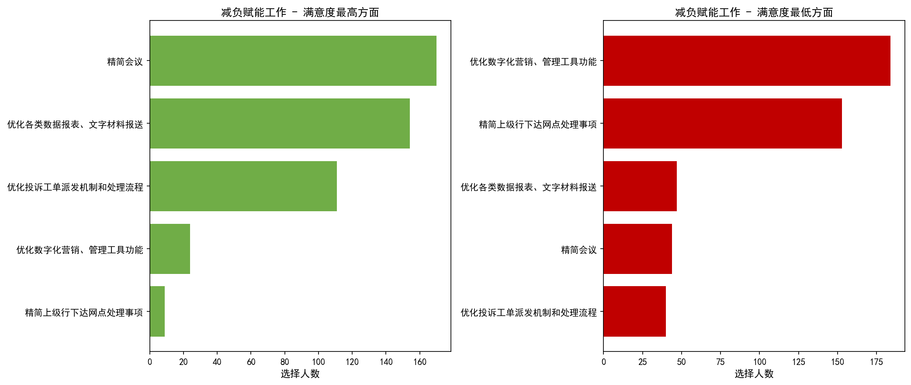
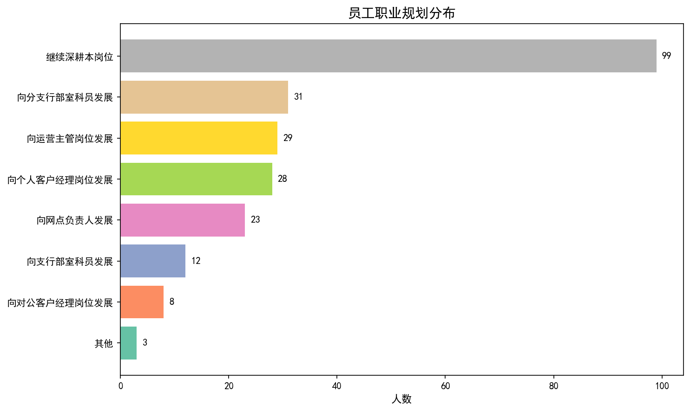

# 2025年下半年网点员工满意度调研报告

**调研单位：** 四川分行
**样本数量：** 234份
**调研时间：** 2026年1月

---

## 目录

- [一、调研概述](#一调研概述)
- [二、样本结构分析](#二样本结构分析)
- [三、满意度评分分析](#三满意度评分分析)
- [四、各维度深度分析](#四各维度深度分析)
- [五、问题与建议](#五问题与建议)
- [六、结论](#六结论)

---

## 一、调研概述

### 1.1 调研背景

本次调研旨在全面了解网点员工对日常工作体验、资源政策支持、减负赋能工作等方面的满意度，为后续改进工作提供数据支撑和决策依据。

### 1.2 调研范围

本次调研覆盖四川分行下辖各二级分行，共回收有效问卷234份。

### 1.3 调研内容

调研涵盖四大维度：日常工作体验、资源政策支持、减负赋能工作、整体工作满意度。

---

## 二、样本结构分析

### 2.1 岗位分布

参与调研的员工岗位分布如下：

| 岗位 | 人数 | 占比 |
|------|------|------|
| 客服经理（柜员） | 69人 | 29.5% |
| 个人客户经理 | 49人 | 20.9% |
| 对公客户经理 | 44人 | 18.8% |
| 客服经理（大堂） | 32人 | 13.7% |
| 网点负责人（含正职和副职） | 22人 | 9.4% |
| 运营主管 | 17人 | 7.3% |
| 其他 | 1人 | 0.4% |

### 2.2 在岗时长分布

员工在当前岗位的任职时长分布：

| 在岗时长 | 人数 | 占比 |
|----------|------|------|
| 0至3年 | 54人 | 23.1% |
| 3至6年 | 67人 | 28.6% |
| 6至10年 | 27人 | 11.5% |
| 10至15年 | 26人 | 11.1% |
| 15年以上 | 60人 | 25.6% |

---

## 三、满意度评分分析

### 3.1 各维度满意度评分概览

四大维度满意度评分（满分10分）：

| 维度 | 平均分 | 标准差 |
|------|--------|--------|
| 日常工作体验 | 9.96分 | 0.34 |
| 资源政策支持 | 9.97分 | 0.23 |
| 减负赋能工作 | 9.98分 | 0.18 |
| 整体工作 | 9.97分 | 0.23 |

### 3.2 满意度等级分布

满意度等级分布统计：

| 等级 | 人数 | 占比 |
|------|------|------|
| 非常满意 | 230人 | 98.3% |
| 满意 | 3人 | 1.3% |
| 一般 | 1人 | 0.4% |

### 3.3 各二级分行满意度对比

各二级分行平均满意度排名（样本数>=3）：

| 分行 | 平均分 | 样本数 |
|------|--------|--------|
| 四川绵阳分行 | 9.97分 | 234 |

### 3.4 各岗位满意度对比

---

## 四、各维度深度分析

### 4.1 日常工作体验

员工对日常工作体验的评价主要集中在工作时长、上级行服务支持响应效率、关心关爱等方面。

### 4.2 资源政策支持

员工对资源政策支持的评价涉及晋升通道、培训效能、网点运营改革、考核机制等方面。

### 4.3 减负赋能工作

减负赋能工作方面，员工对精简会议、优化报表报送等成效认可度较高，但数字化工具功能仍需改进。

### 4.4 员工职业规划

员工职业规划意向分布：

| 职业规划方向 | 人数 | 占比 |
|--------------|------|------|
| 继续深耕本岗位 | 99人 | 42.5% |
| 向分支行部室科员发展 | 31人 | 13.3% |
| 向运营主管岗位发展 | 29人 | 12.4% |
| 向个人客户经理岗位发展 | 28人 | 12.0% |
| 向网点负责人发展 | 23人 | 9.9% |
| 向支行部室科员发展 | 12人 | 5.2% |
| 向对公客户经理岗位发展 | 8人 | 3.4% |
| 其他 | 3人 | 1.3% |

---

## 五、问题与建议

### 5.1 主要发现

根据调研数据分析，主要发现如下：

1. **整体满意度较高**：各维度平均满意度均在9.9分以上，"非常满意"占比超过98%。

2. **满意度最高方面**：
   - 日常工作体验：工作时长(140人)、上级行服务支持响应效率(114人)
   - 资源政策支持：晋升通道(171人)、培训效能(163人)
   - 减负赋能：精简会议(170人)、优化报表报送(154人)

3. **需改进方面**：
   - 日常工作体验：工作环境(129人)、关心关爱(124人)
   - 资源政策支持：网点运营改革(180人)、考核机制优化(134人)
   - 减负赋能：数字化工具功能(184人)、精简上级事项(153人)

4. **减负成效明显**：客户意见工单减少(196人)、反洗钱协查减少(95人)获最多认可

### 5.2 改进建议

针对调研发现的问题，建议重点关注以下方面：

1. **改善工作环境**：加大对网点通风、温度调节、职工之家等硬件设施的投入和改善。
2. **加强关心关爱**：建立员工关怀机制，关注员工身心健康，提升员工归属感。
3. **推进运营改革**：加快网点运营改革和业务流程优化，提升运营效率。
4. **优化考核机制**：完善网点业绩计量与考核机制，确保公平合理。
5. **提升数字化工具**：优化数字化营销、管理工具功能，提升工具易用性和实效性。
6. **持续减负**：继续精简上级行下达网点处理事项，切实减轻基层负担。

---

## 六、结论

本次调研共收集有效问卷234份，覆盖四川分行各二级分行。调研结果显示：

1. **整体满意度表现优异**：四大维度满意度评分均接近满分，"非常满意"占比超过98%，表明网点员工对各项工作高度认可。

2. **减负赋能成效显著**：精简会议、优化报表报送、减少客户意见工单等工作得到员工广泛认可，减负工作取得实效。

3. **仍需持续改进**：工作环境改善、员工关心关爱、数字化工具优化、考核机制完善等方面仍有提升空间。

4. **员工队伍稳定**：超四成员工表示愿意继续深耕本岗位，职业发展意愿积极向上。

建议继续巩固现有成效，针对员工反映的薄弱环节制定改进措施，持续提升网点员工满意度和获得感。